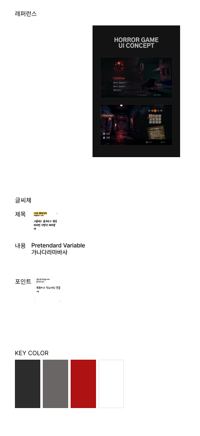
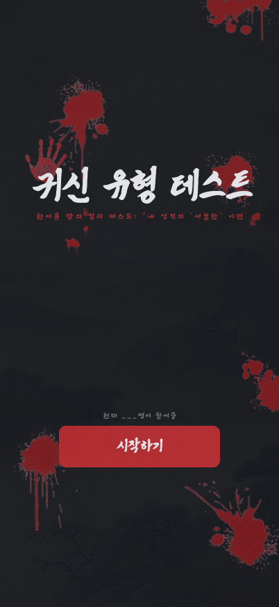
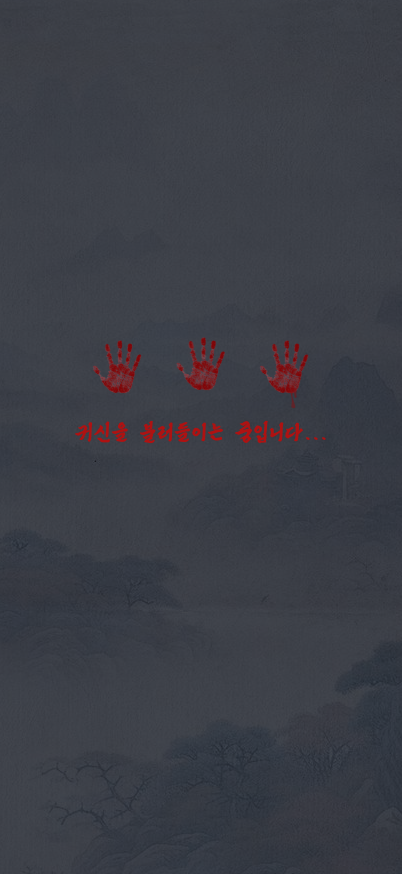
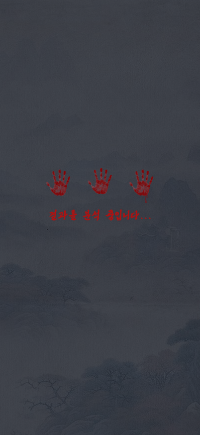
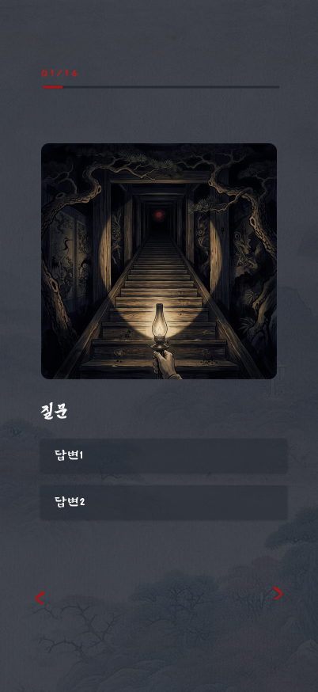
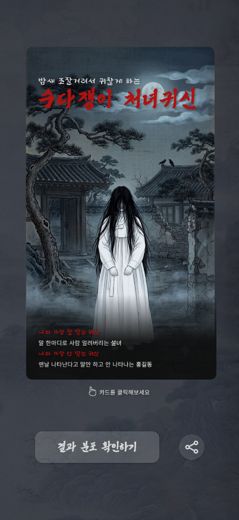
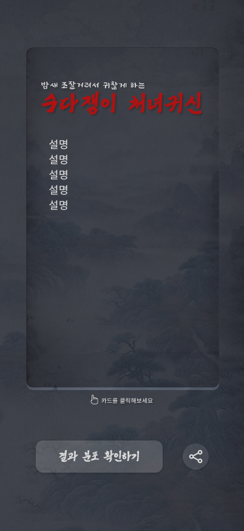
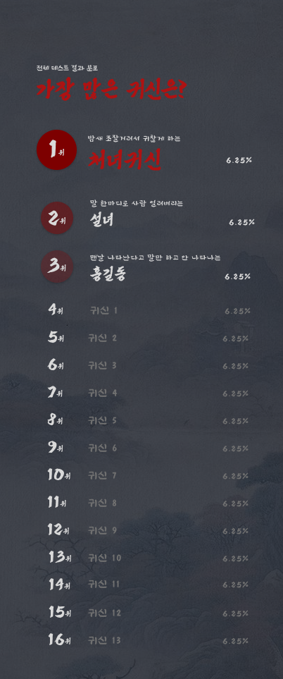

# 👻 귀신 유형 테스트 — 디자인 기반 화면 기획서

> Figma "최종" 페이지 기준 (2026-07-19 확인)
> 원본: [Figma 파일](https://www.figma.com/design/9sAlab4PT7uL385rRhOnJh/?node-id=184-2) · 상위 기획: [PLAN.md](../PLAN.md)

---

## 1. 전체 프로세스

```
[시작화면] ──시작하기──▶ [학교 선택*] ──▶ [로딩 ①: 귀신을 불러들이는 중] ──▶ [질문 1~8]
                                                                            │ 마지막 답변
                                                                            ▼
[결과 카드 뒷면] ◀──카드 클릭(플립)──▶ [결과 카드 앞면] ◀── [로딩 ②: 결과를 분석 중]
        │                                   │
        └──────── 결과 분포 확인하기 / 공유 ────────┘
                        │
                        ▼
              [순위: 전체 결과 분포]
```

- 디자인된 화면은 **7종**: 시작 → 로딩① → 질문 → 로딩② → 결과 앞면 → 결과 뒷면 → 순위.
- `*` 학교 선택 화면은 디자인 없이 **프론트에서 스타일 가이드에 맞춰 자체 제작** (3.5장 참고).

---

## 2. 스타일 가이드



| 요소 | 정의 |
|---|---|
| 레퍼런스 | Horror Game UI Concept — 어두운 게임 UI 무드 |
| 제목 서체 | 붉은 붓글씨 계열 손글씨체 (호러 타이틀용) |
| 내용 서체 | Pretendard Variable |
| 포인트 서체 | 손글씨 계열 (캡션·힌트용) |
| KEY COLOR | 차콜 블랙 / 그레이 / 딥 레드 / 화이트 4색 |

- 배경은 전 화면 공통으로 **어두운 동양 산수화 텍스처 + 안개** 위에 콘텐츠가 올라가는 구조.
- 프로젝트에 이미 세팅된 폰트(Pretendard, 울산중구체, 그리운 폴센스빌리티)와 매핑해 사용.

---

## 3. 시작화면



| 요소 | 내용 |
|---|---|
| 배경 | 차콜 + 핏자국 스플래터 + 붉은 손바닥 자국 |
| 타이틀 | "귀신 유형 테스트" — 붉은 붓글씨 |
| 서브카피 | 한여름 밤의 심리 테스트: "내 성격의 '서늘한' 이면" |
| 참여자 카운터 | "현재 \_\_\_명이 참여중" — 백엔드 집계 연동 |
| CTA | [시작하기] — 딥 레드 버튼 |

**인터랙션 아이디어**: 참여자가 10명 늘 때마다 피 손바닥이 무작위 위치·크기·회전으로 하나씩 추가되는 연출 — 손바닥 에셋을 absolute 배치하고 참여자 수를 시드로 결정적 랜덤 생성하면 됨. (초기 디자인의 질문 메모는 확정 후 제거됨)

---

## 3.5 학교 선택 (프론트 자체 제작)

디자인 시안 없음 — 스타일 가이드(2장)를 따라 프론트에서 제작한다. **사용자 피로도 최소화**가 원칙.

| 요소 | 내용 |
|---|---|
| 구성 | 화면 중앙 **검색 박스 하나**만 배치 (다른 입력 요소 없음) |
| 동작 | 타이핑과 동시에 **실시간 자동완성 목록** 표시 → 탭 한 번으로 선택 완료 |
| 검색 | `GET /schools?query=` 디바운스 호출 (150~300ms) |
| 건너뛰기 | 하단에 텍스트 링크로 제공 (PLAN.md §4 — 허용 확정) |
| 스타일 | 다크 배경 + 반투명 다크 입력 필드 (질문 화면 답변 버튼과 동일한 톤) |

---

## 4. 로딩 화면 (2종)

| 로딩 ① — 시작 → 질문 | 로딩 ② — 질문 → 결과 |
|---|---|
|  |  |
| "귀신을 불러들이는 중입니다..." | "결과를 분석 중입니다..." |

- 붉은 손바닥 3개가 순차적으로 찍히는 애니메이션 (레이어 구조상 프레임 순차 노출).
- 로딩 ②는 결과 판정 API 응답 대기를 겸함 — 최소 노출 시간을 둬 긴장감 조성 (PLAN.md §5.4).
- 로딩 ①은 연출용 (질문 데이터 프리페치 타이밍으로 활용 가능).

---

## 5. 질문 화면



| 요소 | 내용 |
|---|---|
| 진행 표시 | 좌상단 "Q1/8" + 붉은 진행 바 (시안의 "Q1/16" 표기는 오기 — **8문항 확정**) |
| 일러스트 | 질문별 동양풍 호러 일러스트 카드 (정사각형) |
| 질문 텍스트 | 붓글씨 서체 |
| 선택지 | **2지선다 고정 (확정)** — [답변1] / [답변2] 반투명 다크 버튼 |
| 네비게이션 | 좌하단 `<` (이전) / 우하단 `>` (다음) 붉은 화살표 |

- 진행 바는 문항 수에 비례해 채워짐.
- `<`로 이전 문항 복귀·답 수정 가능 (PLAN.md §5.3과 일치).

---

## 6. 결과 화면 — 플립 카드

| 앞면 | 뒷면 |
|---|---|
|  |  |

**카드 앞면**
- 수식어 + 유형명: "밤새 조잘거려서 귀찮게 하는" / **"수다쟁이 처녀귀신"** (붉은 붓글씨)
- 유형 일러스트 (전신, 동양화풍)
- 하단 궁합 영역:
  - 나와 가장 잘 맞는 귀신 — "말 한마디로 사람 얼려버리는 **설녀**"
  - 나와 가장 안 맞는 귀신 — "맨날 나타난다고 말만 하고 안 나타나는 **홍길동**"

**카드 뒷면**
- 동일한 수식어 + 유형명 헤더
- 유형 상세 설명 (리스트형 여러 줄)

**공통 하단**
- "🖐 카드를 클릭해보세요" 힌트 → 카드 탭 시 앞/뒤 플립 인터랙션
- [결과 분포 확인하기] 버튼 → 순위 화면 이동 (7장)
- 원형 공유 버튼 → 토스 공유 링크 (PLAN.md §6.1)

---

## 7. 순위 (전체 결과 분포)



| 요소 | 내용 |
|---|---|
| 헤더 | "전체 테스트 결과 분포" 캡션 + "가장 많은 귀신은?" 붉은 붓글씨 타이틀 |
| 1~3위 | 강조 표시 — 붉은 원형 배지(크기 차등) + 수식어 + 유형명(1위는 붉은 붓글씨 대형) + 비율 % |
| 4~16위 | 간결한 리스트 — 순위 + 유형명 + 비율 % |
| 데이터 | `GET /stats/global` (16개 유형 전체 분포, 비율 내림차순 정렬) |

- 세로로 긴 스크롤 화면 (963pt).
- 내 유형 행 하이라이트 표시 검토 (구현 시 추가 제안).
- **학교별 통계 뷰는 아직 디자인 없음** — 이 화면의 변형(학교 필터 탭 등)으로 협의 필요.

---

## 8. 확정 사항 및 잔여 이슈

| # | 항목 | 확정 내용 |
|---|---|---|
| 1 | 문항 수 | **8문항** (디자인의 "Q1/16" 표기는 오기 — 시안 수정 요청) |
| 2 | 학교 선택 | **프론트 자체 제작** — 검색 박스 단일 + 실시간 자동완성 (3.5장) |
| 3 | 전체 분포 화면 | **순위 페이지 디자인 추가됨** (7장) |
| 4 | 선택지 | **2지선다 고정** |
| 5 | 로딩 ① (질문 전) | 채택 |
| 6 | 결과 카드 플립 | 채택 |
| 7 | 피 손바닥 증식 이스터에그 | 채택 (참여자 수 시드 기반) |

**잔여 이슈**
- 학교별 통계·학교 랭킹 화면 디자인 없음 (순위 페이지 변형으로 협의)
- 질문 화면 "Q1/16" → "Q1/8" 시안 수정 필요

---

## 9. 프론트 구현 매핑 (라우트 제안)

| 라우트 | 화면 | Figma 노드 |
|---|---|---|
| `/` | 시작화면 | `184:106` |
| `/school` | 학교 선택 (자체 제작) | — |
| `/loading` (연출) | 로딩 ①·② 공용 컴포넌트 | `184:87`, `184:96` |
| `/quiz` | 질문 (1~8 인덱스 상태) | `184:74` |
| `/result/:typeId` | 결과 플립 카드 | `184:18`(앞), `184:46`(뒤) |
| `/stats` | 순위 (전체 분포) | `184:129` |
